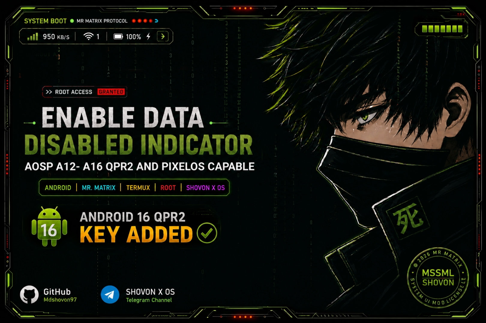
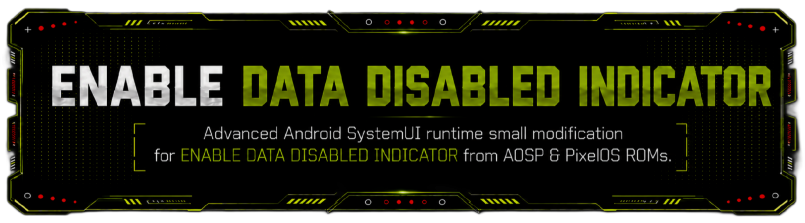

## Legal & License

This project contains original SystemUI modifications authored by **MD SHOVON**.

Licensed under the **MD SHOVON SYSTEMUI MOD LICENSE (MSSML) v1.0**.

### You are allowed to:
- Use for personal and educational purposes
- Study and learn from the implementation
- Share the unmodified version

### You are NOT allowed to:
- Claim authorship
- Remove credit
- Re-license
- Sell or monetize
- Include in proprietary or closed-source projects

This modification is provided **AS IS**.
The author is not responsible for device damage or data loss.

### Video Guide
Watch the full step-by-step tutorial (21 min):  
https://drive.google.com/file/d/1oHEXFVO4q9DOAs74ep1Q2P5UxisUNamp/view
**Original modification by MD SHOVON**
